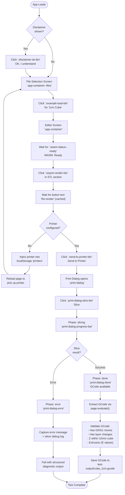

# Slice Cube E2E Test — UI Flow

## Mermaid: Full UI Flow (File Selection → Slice → GCode)

## Test Strategy

The test:
1. Injects a fake printer into localStorage (avoids needing a real Moonraker instance)
2. Navigates to the app via URL with `?example=cube_1cm.scad` to skip file selection
3. Waits for WASM to load, renders STL, opens print dialog, slices
4. Extracts the GCode string from the browser context
5. Validates GCode structure (moves, layers, dimensions, extrusion)
6. Saves GCode to disk for offline inspection
7. On failure, captures full diagnostic context (console logs, slicer debug log, screenshots)

## CSS Selectors Reference

| Step | Selector | What |
|------|----------|------|
| Disclaimer | `.disclaimer-ok-btn` | Accept button |
| Load example | `.example-load-btn` | Per-example load button |
| WASM ready | `.wasm-status--ready` | Status indicator |
| Render STL | `.export-render-btn` | First render button (STL section) |
| Send to printer | `.send-to-printer-btn` | Opens printer dropdown |
| Printer option | `.send-to-printer-option` | Specific printer in dropdown |
| Slice | `.print-dialog-slice-btn` | Start slicing |
| Progress | `.print-dialog-progress-bar` | Slicing progress |
| Done | Text: "Slicing complete" | Success indicator |
| Error | `.print-dialog-error` | Error container |
| Download | `.print-dialog-download-btn` | Download GCode button |
